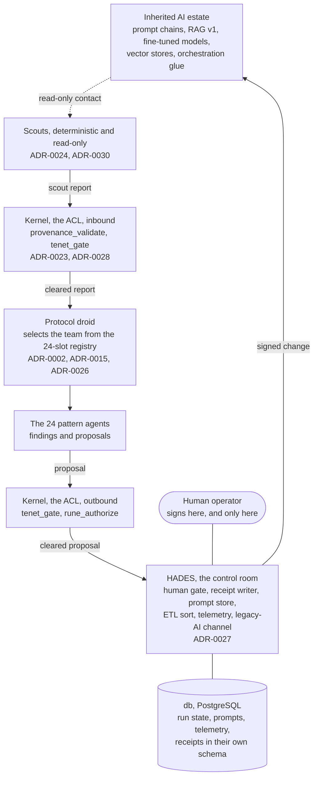

# Ag3nt24 architecture overview

**Version:** 0.1.0
**Date:** 2026-09-11
**Owner:** Lawrence Jefferson II
**Status:** Design, with two modules built. Nothing here is a capability claim.

---

## As-built status, 2026-09-11

Read this before anything else in the document.

- **Implemented agents: 0.** Twenty-four roles are specified in ADR-0002 and the roster is frozen in ADR-0015. None are built. There is no behavior in them yet.
- **Built and green:** `packages/ag3nt24_contracts` (the canonical serializer and evidence hash). The 24-slot registry, `conformance/registry.json`, and the ITF-to-rune translation, with conformance reporting `checks: 81/81`, `registry: 24/24 match`, `join: 24/24 match` and `5/5 match`.
- **Built, being replaced:** the four COBOL gates in `kernel/`. They build with GnuCOBOL 3.2.0 on a development machine and reproduce their pinned verdicts. ADR-0028 rebuilds them in Python; the COBOL becomes the reference implementation and the differential harness fails on a one-byte disagreement. That port is module 1 and has not started.
- **Ruled, not built:** scouts, the protocol droid, the model adapter, HADES, the frontend, and the data layer.
- **Left over, do not build on:** `bridge/shim.js`, a Phase 3 remnant. ADR-0029 takes Node off the runtime path.
- **Pilot target: none.** ADR-0032 removed Gunkustom.com and withdrew ADR-0019.

Everything below is the design. Treat it as specification, not capability.

---

## What Ag3nt24 is

Ag3nt24 Droid Protocol Multi-Agent Framework with Anti-Corruption Layer, a legacy AI systems modernization framework. Twenty-four pattern agents do the protocol droid work at the seam between an inherited AI estate and a modern stack. They propose, a human signs before anything changes state, and every signature leaves a receipt that cannot be quietly altered.

**The estate it modernizes** is the AI system a business assembled between 2021 and 2026 as the field changed under it: prompt chains, RAG v1, fine-tuned models, vector stores, orchestration glue, vendor lock-ins. The failure mode is the classic legacy one. Nobody inside can establish what the system actually does, so nobody will sign off on the replacement. Ag3nt24 establishes it, certifies the data, and rebuilds behind a human-controlled boundary.

## Scope

**In scope now:** the kernel and its gates, the contracts, the registry, the scouts, the protocol droid, HADES, and the operator surfaces.

**Deferred:** nothing is queued as a second pilot; ADR-0032 dropped the mock mainframe stack. Military and defense systems integration is out of scope and has no design accommodation.

## System context

Two gates, two words: the kernel is the ACL, HADES holds the gate. The kernel logs and writes no receipts. Clearing the kernel is never authorization to act.

## Components

### Kernel, the Anti-Corruption Layer

Four gates, `tenet_gate`, `provenance_validate`, `rune_authorize` and `rune_rotation`, at the boundary between the inherited estate and the framework. Every crossing passes through it in both directions (ADR-0023). Inbound, a scout report is invisible to the protocol droid until `provenance_validate` accepts its envelope and `tenet_gate` returns `DECISION=A`. Outbound, every proposal clears `tenet_gate`, and `rune_authorize` confirms the pattern holds the requested capability on the current rotation table. A pattern that does not is denied `NOT_AUTHORIZED_FOR_TODAY`, logged and escalated in HADES.

Deterministic by construction: gates run on slot indices, so the same input returns the same verdict every time. No sampling, no drift.

The gates ship as `ag3nt24_kernel`, Python, imported by the API service. The COBOL stays in `kernel/` as the reference implementation, still building with GnuCOBOL 3.2.0 on a development machine, never deployed (ADR-0028). `npm run conform` runs both and fails on any disagreement.

The boundary is enforced by an import rule rather than a process boundary (ADR-0029). `ag3nt24_kernel` imports nothing from `core` or `hades`, exposes only the gate functions, and a test asserts it. That is a weaker guarantee than a separate service, recorded deliberately: if the boundary ever has to be provable to an outside auditor, the kernel goes back behind its own service and nothing else changes.

### Scouts

Deterministic crawlers, not personas, and not among the 24 (ADR-0024). They are the only component allowed to touch the estate before the ACL, and everything they produce crosses the ACL before any pattern sees it. Read-only. No model call by default; a scout that needs one declares it in its spec and the call is logged. The first scout covers the modern AI estate: HTTP and OpenAPI surface, prompt file discovery, vector-store and model configuration, orchestration entry points.

One scout report per contact, findings tagged `observed` and never stronger, one evidence hash per finding.

### Protocol droid and the 24

The droid reads the cleared report, selects the patterns the operation needs from the registry, activates them with their charters, and hands the report to the team. The team returns findings and proposals.

Each of the 24 is bound to one pattern of the ITF Chang Hon syllabus, which gives it a discipline attribute, an operational duty, a stance and a failure mode. The registry refuses to load if any pattern lacks an agent, any agent lacks a pattern, or any capability is claimed twice. That load-time validation is what "24-slot pattern registry" means.

Findings carry provenance, `observed`, `inferred` or `reported`, and no confidence score. A human at the gate can check how an agent came to know something; they cannot check `0.87`.

There is no twenty-fifth agent. A new capability is a configuration of an existing pattern.

### HADES

The human's only surface (ADR-0027). It holds the gate and the receipt writer, the prompt store including the 24 charters, human interaction with the ETL pipeline, all telemetry, and the legacy-AI channel.

The Data Lake sort is `good | bad | messy | work-data | new`. Only `bad` reaches the Human Authorized Data Eradication Sequence, and only through a signature. There is no auto-eradication path. Eradication is the most control-affecting action in the system and takes the ordinary path for one: a `GateRequest`, a human signature, one `Receipt`, then execution.

ADR-0031 proposes durable in-database orchestration for the ingest and sort, with the gate terminating a durable run and a signature starting a new one. It is proposed, not ruled, and no code depends on it.

### Contracts package

`ag3nt24_contracts`, the only package both services may import (ADR-0010). Six Pydantic models: `AgentSpec`, `GraphState`, `GateRequest`, `Receipt` (ADR-0011), and `ScoutFinding`, `ScoutReport` (ADR-0030). Strict mode, `schema_version` on each, frozen after construction where the model is evidence. A breaking version bump takes its own ADR.

### Containers

Three (ADR-0029).

| Container | Contents |
|---|---|
| `api` | Python 3.13, FastAPI. HADES, the protocol droid, the scouts, the model adapter, and the kernel gates as an imported package |
| `web` | The built React bundle, served statically. A client of the API holding no business rules |
| `db` | PostgreSQL. Run state, prompts, telemetry, and receipts in their own schema |

Node is a frontend build dependency only. It does not appear in a runtime image.

### Model adapter

One request and response shape for any provider: Anthropic, OpenAI-compatible endpoints, and local runtimes, chosen by environment. No provider-specific type crosses the adapter. Provider quality differences are the adapter's problem and get measured, never assumed.

### Tools

MCP, hosted by the API service, with no gateway product in between. Each MCP server declares whether it is read-only or control-affecting. No agent opens a socket to a target directly.

Tool output is untrusted input. A fetched page, an API response or a prompt file found on the estate is data, never an instruction to the agent reading it.

## The run flow

1. A run starts with a task, a target and a budget.
2. A scout makes read-only contact with the estate and emits a scout report.
3. The report crosses the kernel inbound. A failed gate denies, records why, and escalates to a named person.
4. The protocol droid reads the cleared report and selects the team from the registry.
5. The team returns findings and proposals against its declared slice of state.
6. A control-affecting proposal crosses the kernel outbound, then lands in HADES as a `GateRequest`. The run checkpoints and waits.
7. A human approves or denies in HADES. Exactly one `Receipt` is written, hash-chained to its predecessor.
8. On approval the run resumes and the change executes. On denial the run ends with the reason recorded.

Read-only discovery does not gate. Everything that writes, mutates, deploys, configures or commands does (ADR-0008).

Verdicts are evidence. Human signatures are authority. No agent carries ledger-write authority.

## Storage

Four concerns, never collapsed (ADR-0006 as amended by ADR-0025).

| Concern | Store |
|---|---|
| Charters, human-authored source of truth | This repository, in Git |
| Run state, prompts, telemetry | `db`, PostgreSQL |
| Vector and RAG per domain | A local vector store, derived data; losing one costs a rebuild |
| Audit receipts, append-only and hash-chained | Their own schema in `db`, with a write credential held only by the gate route |

The receipt store shares no schema and no write credential with run state.

## Prompt lifecycle

The Markdown charter in this repository is authored and reviewed as a diff. The HADES prompt store holds the deployed artifact, and each agent loads its prompt pinned to a version.

Publishing a charter into the store is a manual human step with the source commit SHA recorded on the version. No auto-deploy from a merged file to a live prompt. A missing prompt version is a hard failure with no inline fallback.

## Telemetry and cost

One pipeline, tagged with the ITF slot at the source before anything is emitted, OpenTelemetry format so any backend can read it, landing in HADES. Group view aggregates the tag, individual view filters it. The format and the per-agent cost mechanism are ADR-0018, still open.

The operator surfaces are read-only against agent state. Every action they offer is an API call through the same path an agent's own call takes. No privileged side door.

## Security and trust boundaries

| Boundary | Control |
|---|---|
| Human to API | Per-user identity, so a receipt names a person and not a shared account |
| API to receipt schema | Write only on the gate decision path; read-only credentials everywhere else |
| Estate to framework | The kernel, in both directions, on every crossing |
| Scout to estate | Read-only. A scout that needs write access is a different component and takes an ADR |
| Agent to target system | MCP only, control-affecting tools gated |
| Tool output to agent reasoning | Treated as untrusted data, never as instruction |
| Charter to running prompt | Manual publish gate, source commit SHA recorded on the version |

Signing keys for receipts are production secrets with a rotation policy. Never in code, config or logs.

## Constraints this design accepts

- **No vendor dependency to run.** Anyone with Docker can run the kernel, the registry and a scout. A cloud target takes its own ADR (ADR-0025).
- **Throughput is bounded by human review.** That is the intended trade (ADR-0008).
- **One person operates this.** Anything needing a rota does not get built (ADR-0013).
- **Twenty-four is fixed.** A new domain merges into an existing role or forces a merge elsewhere (ADR-0002).
- **The import rule is weaker than a process boundary.** Accepted knowingly, reversible without redesign (ADR-0029).

## Language rules for this project

"Autonomous" is not used. Agents propose, humans sign. A line of work is `active` or `ended`, never "paused." Never "24 implemented agents"; the 24 are registered, not implemented. Role definitions carry industry-standard domain naming and no personal or business philosophy. No services, no pricing. No capability claim without something real behind it.

## Decision index

**Accepted:** ADR-0001, 0002, 0006, 0008, 0010, 0011, 0013, 0014, 0015, 0016, 0020 through 0030, 0032.
**Superseded:** ADR-0003, 0004, 0005, 0007, 0009 by ADR-0025. ADR-0012 by ADR-0032.
**Withdrawn:** ADR-0019 by ADR-0032.
**Proposed, not ruled:** ADR-0031 (durable orchestration for the HADES sort).
**Open, needs a ruling:** ADR-0017 (route list), ADR-0018 (tagging scheme).

One known defect in an accepted record: ADR-0021 states the kernel binary is reproducible from its build manifest. The executable hashes are not reproducible on this toolchain; the source hashes are stable and do match. That claim needs narrowing or withdrawing.

Full text in [docs/adr/](../adr/). Build sequencing in [docs/plan/](../plan/).

---
LAHA — Love All Humans Always.
